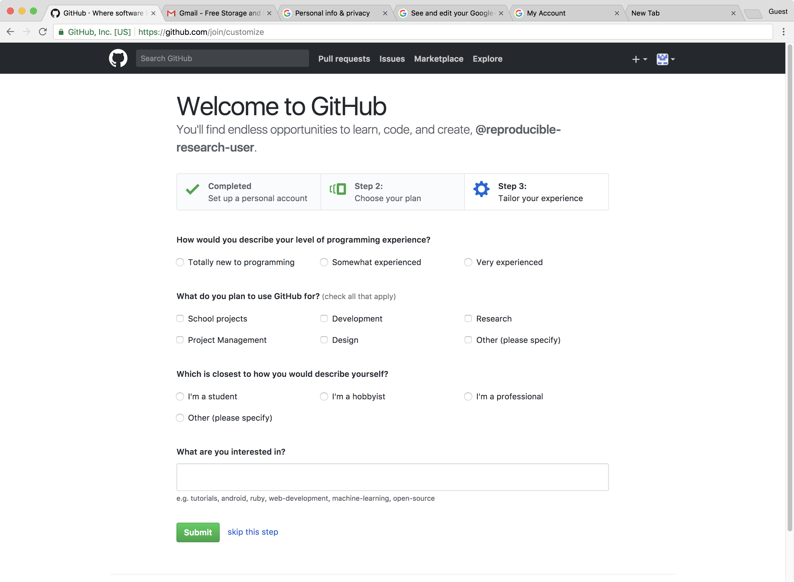
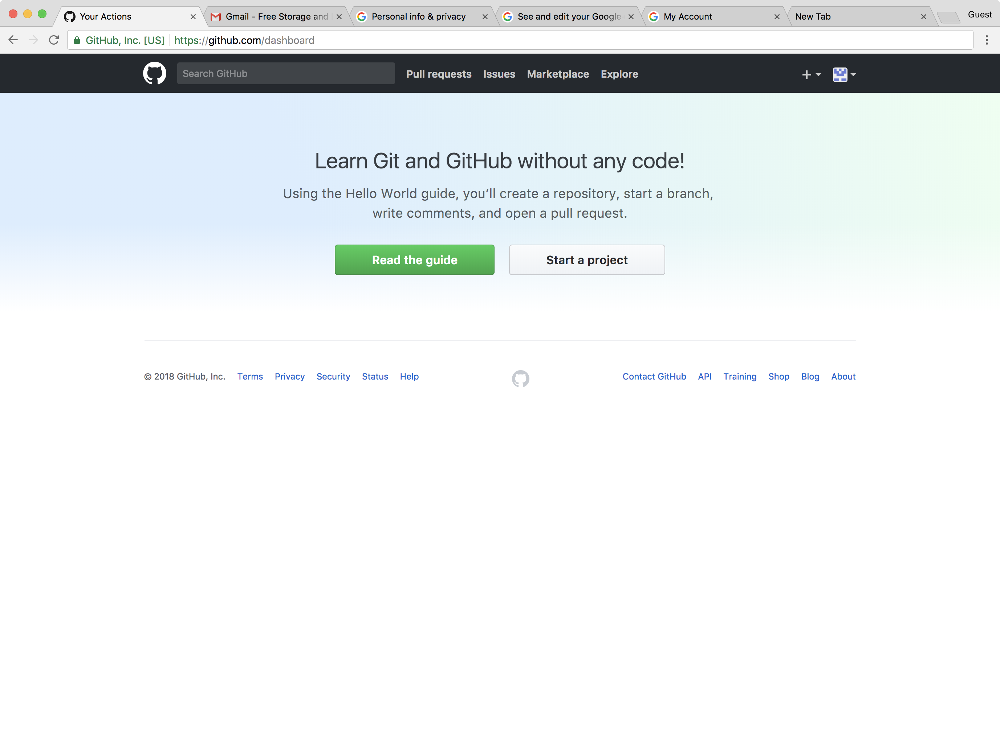
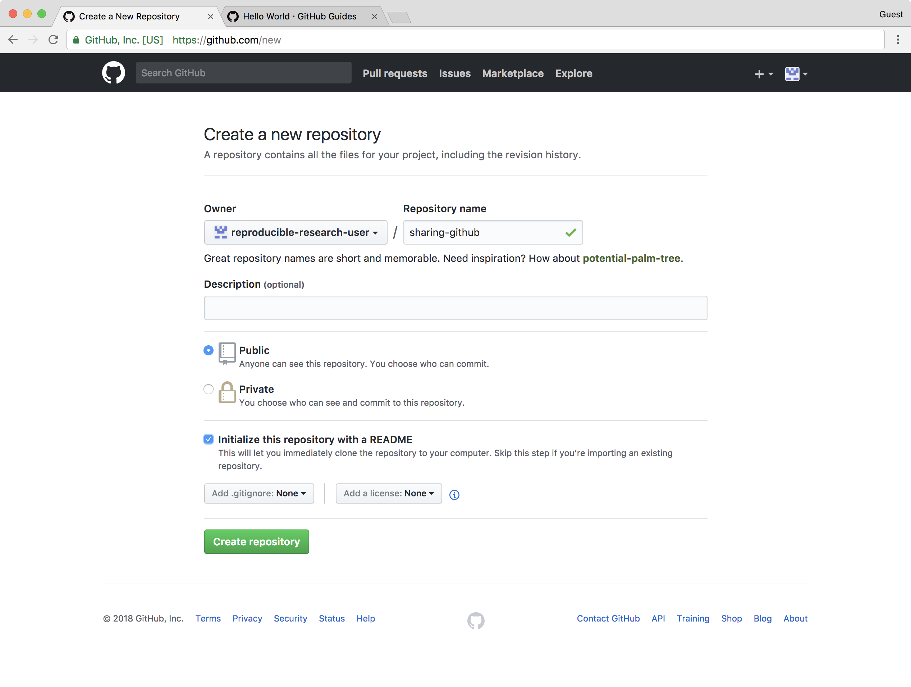
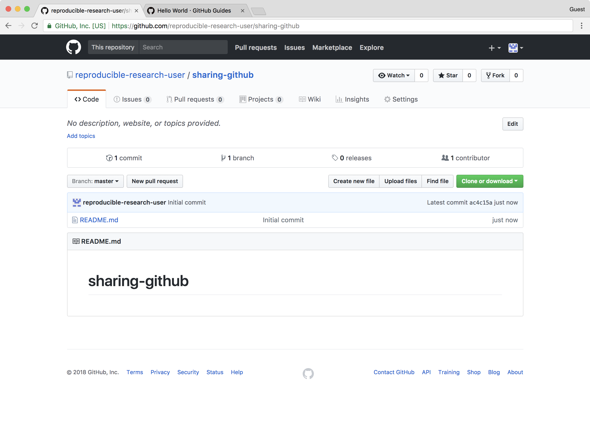
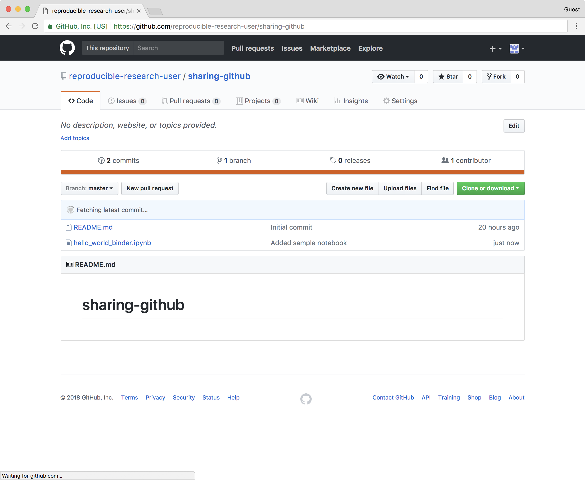
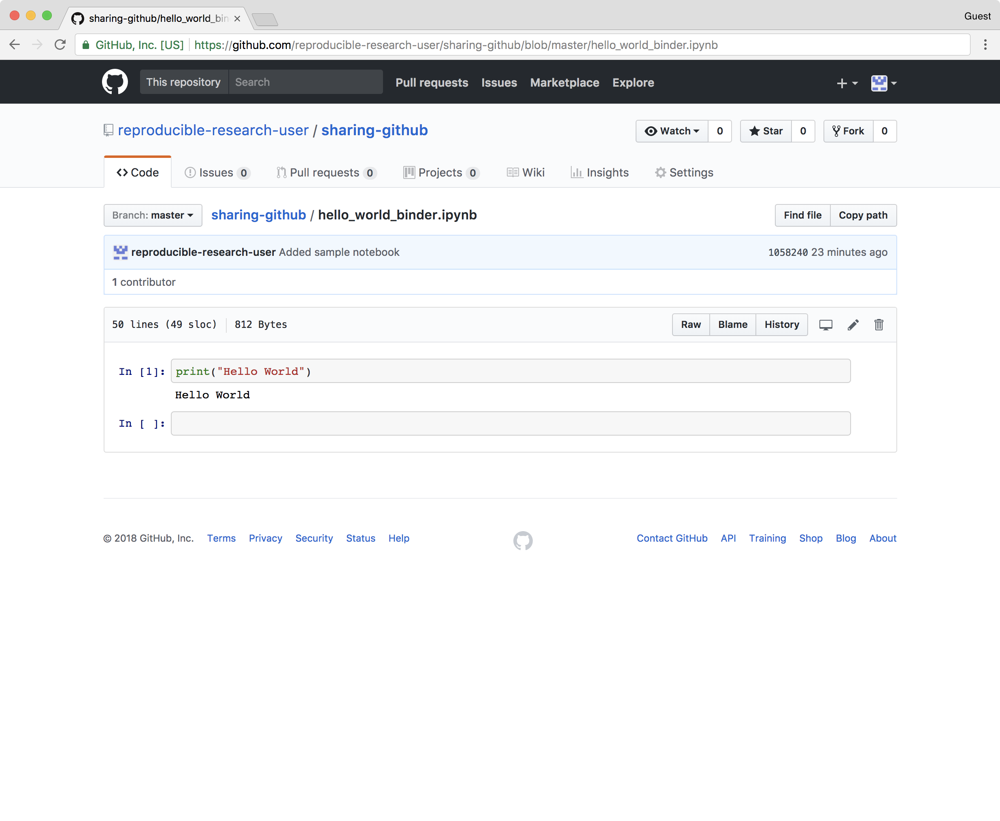

# Sharing using GitHub

In this lesson we will learn:

- How to create a GitHub account and add an initial project repository. A repository is a central location where source code and data is stored and managed
- How to add a file to the repository using GitHub's web interface
- How to visually confirm that files have been added to the repository and preview files using the GitHub interface
- The concepts of creating a public repository for the purpose of sharing your research data

## GitHub

GitHub is a development platform where we "can host and review code, manage projects, and build software." GitHub hosts source code for 75+ million projects including the `pandas` package we have been using among many others. 

### 1. Go to the GitHub Homepage

To use GitHub one needs to register for a (free) account. To register for a GitHub account we need to:

1. Open a web browser
2. Navigate to [github.com](https://github.com)

We should see the the web page below.

**Note**: If you already have a GitHub account you do NOT need to create a new one. Please skip down to step ????.

### 2. To create a GitHub account 

- On the GitHub homepage enter:

    - a username
    - an email address
    - a password

- Click the gree _Sign up for GitHub_ button.

An example is shown in the screenshot below.

We are asked to confirm the email address that we used to sign. Please confirm the email address.

**Select a plan**

We have to choose a plan that we would like to use. We will use the personal (default) plan.

Click on _Continue_.

**Completing our signup**

We can select any options we would like (on none).

Click _Submit_ to complete our `Github` account setup.

### 3. Create a new reprository

- Click on _Start a project_ as shown below.

To create a new repository:

- Add a repository name. We choose to name our repository `sharing-github`.
- Personal GitHub accounts require that projects be _public_.
- Check the _Initialize this repository with a README_ option.
- Click the green _Create repository_ button.

After creating the new repository, we will be taken to the project homepage (shown below).

If we click on the GitHub icon at the top of the page, we will go to our GitHub homepage.

Our GitHub homepage will now show the new repository under _Your repositories_ (as shown below).

**Congratulations!!** We now have a GitHub account and we have created our first repository. 

### 4. Uploading an example file (notebook) to the repository

We will use GitHub's web interface to upload our files to our new repository. 

Before we upload one of our existing files, we will first create a new notebook with a "print('hello world')" `Python` statement in a single cell. 

#### 4.1 Create a new sample notebook

To acomplish this, please follow the step below:
- At the Jupyter dashboard, click on _New_ button and select a `Python 3` notebook.
- In the first cell of the notebok, type the `Python` atatement:

        print('hello world')

- Run the cell to confim that the `Python` statemnt does not have any bugs.
- Save the notebook as "hello_world_binder.ipynb"

#### 4.2 Upload the new sample notebook to our GitHub repository

To add our new sample notebook to our GitHub repository, we will return to our repository's homepage at <https://github.com>.

To upload our file:
- Go to [GitHub](https://github.com) in our browser. We can click the link to the left.
- Click on the `sharing-github` repository
- Click on the _Upload file_ button
- Drag and drop the sample notebook or click the _choose your files_ link to select the sample notebook.
    - We will see any files that we have uploaded at the bottom of the drag and drop area.
- Add a message describing the change we are about to make.
    - Type "Added sample notebook" in the subject field. 
    - We can either add the same message below in the extended dwscription or leave it blank.
- Click on _Commit changes_ button to complete the uplaod.

After commiting the change we should see that there are now two files in the repository: 1) the README and 2) the new sample notebook (as seen in the screenshot below).

We can actually preview the notebook by clicking on it (shown below)

### 5. Upload our previous working notebook to the repository

In anticipation of our next lesson on sharing using the capability of [Binder](https://mybinder.org), we need to upload the notebook that we have bene working on. To do this we will repeat many of the steps above.

To upload our file:
- Return to `sharing-github` repository on GitHub
- Click on the _Upload file_ button
- Drag and drop the data analysis notebook completed in the previous lesson or click the _choose your files_ link to select the notebook.
    - We will see any files that _we_ have uploaded at the bottom of the drag and drop area.
- Add a message describing the change we are about to make.
    - Typing "Added data analysis notebook" in the subject field. 
    - We can either add the same message below in the extended dwscription or leave it blank.
- Click on _Commit changes_ button to complete the uplaod.

After commiting the change we should see that there are now three files in the repository: 1) the README and 2) the sample notebook and 3) our new data analysis notebook.

To learn more about GitHub you can review one or more of these additional (external) resouces:
- GitHub Guide - [Hello World](https://guides.github.com/activities/hello-world/)
- All the [GitHub guides](https://guides.github.com)
- Hubspot [`git` and GitHub tutorial](https://product.hubspot.com/blog/git-and-github-tutorial-for-beginners)
- Plurlsight's [GitHub beginner's guide](https://www.pluralsight.com/blog/software-development/github-tutorial)
- Code School's [GitHub tutorial](https://www.codeschool.com/courses/mastering-github)

If you would like to learn about source code version control using the `git` software, the `git` in GitHub, please see these resources:
- Try this 15 minute interactive  [`git` tutorial](https://try.github.io/)
- Try some additioanl `git` excersizes [here](https://gitexercises.fracz.com)
