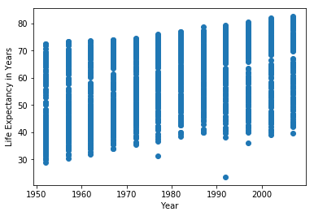

```python
import pandas as pd
import matplotlib.pyplot as plt

%matplotlib inline
```


```python
url = "https://raw.githubusercontent.com/Reproducible-Science-Curriculum/automation-RR-Jupyter/gh-pages/notebooks/gapminder_cleaned.csv"
```


```python
gapminder = pd.read_csv(url)
```


```python
plt.scatter(gapminder['year'], gapminder['lifeexp'])
plt.xlabel('Year')
plt.ylabel('Life Expectancy in Years')
```


    Text(0,0.5,'Life Expectancy in Years')




